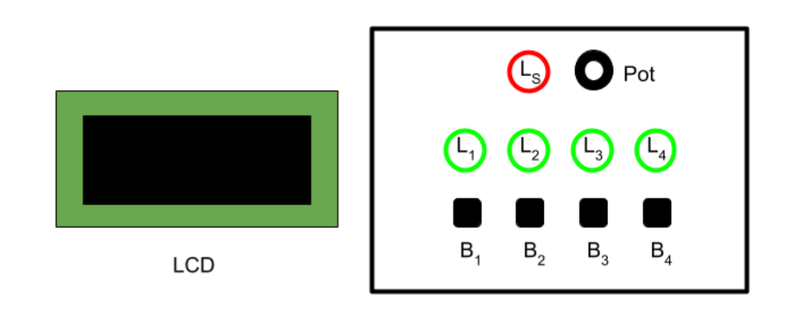

# GMB---First-Arduino-Project-for-IoT
# Give Me the Binary!

[Project on Tinkercad](https://www.tinkercad.com/things/jXmeB3YPK8F/editel)

### Description

The game board includes 4 green LEDs L1, L2, L3, L4 and red LED LS, four tactile buttons B1, B2, B3, B4, a potentiometer Pot, and an LCD. This is the suggested layout:

In the game, LEDs represent the binary digits of a number (0..15). During the game, the system repeatedly displays a number in decimal notation on the LCD and the player must turn on the proper LEDs defining the same number in binary notation (L1 is the most significant bit, L4 the least significant bit). For instance, if the number 13 is displayed on the LCD, the player must turn on the LEDs L1, L2, and L4. To turn on the LEDs, the player can use the tactile buttons. Each button Bi turns on the corresponding LED Li. Each game involves multiple rounds. At each round, a number (at random) is displayed and the player must compose the binary version within some maximum time T1. If the player does it right, a score - starting from zero - is increased and the game goes on with another round, reducing the time T1 by some factor F. If the player does not compose the correct number on time, the red LED LS is turned on for 1 second and the game ends, displaying the score on the LCD.

### Game Behaviour in Detail

In the initial state, all green LEDs should be off but LED LS pulses (fading in and out), waiting for some player to start the game. The LCD should display the message “Welcome to GMB! Press B1 to Start” (on multiple lines).

If/when the button B1 is pressed, the game starts. If the B1 button is not pressed within 10 seconds, the system must go into deep sleep. The system can be awoken by pressing any button. Once awoken, the system goes to the initial state and the LED LS starts pulsing again. When the game starts, all LEDs are turned off and a “Go!” message is displayed on the LCD. The score is set to zero.

During the game, at each round:
- The LEDs L1…L4 are turned off and a random number between 0 and 15 is displayed on the LCD.
- The player has max T1 time for composing the binary version by pressing the buttons B1…B4 (each button Bi turns on the corresponding LED Li).
- If the player composes the correct number on time, then:
    - The score is increased and a message "GOOD! Score: XXX" (where XXX is the current score) is displayed on the LCD.
    - The game goes on with another round, reducing the time T1 by some factor F.
- If the player does not compose the correct number on time, then the red LED LS is turned on for 1 second and the game ends: a message "Game Over - Final Score XXX" (where XXX is the final score) is displayed on the LCD (on multiple lines) for 10 seconds, then the game restarts from the initial state.

Before starting the game, the potentiometer Pot device can be used to set the difficulty level L, which could be a value in the range 1..4 (1 easiest, 4 most difficult). The level must affect the value of the factor F (so that the more difficult the game is, the greater the factor F must be).

### The Assignment

Develop the game on the Arduino platform, implementing the embedded software in C using the Wiring framework. The game must be based on a superloop control architecture. Choose concrete values for parameters to have the best gameplay. For any other aspect not specified, make the choice that you consider most appropriate. The deliverable must be a zipped folder `assignment-01.zip` including two subfolders:
- `src` including the Arduino project source code
- `doc` including:
    - A representation of the schema/breadboard using tools such as TinkerCad, Fritzing, or Eagle
    - A short video (or the link to a video on the cloud) demonstrating the system